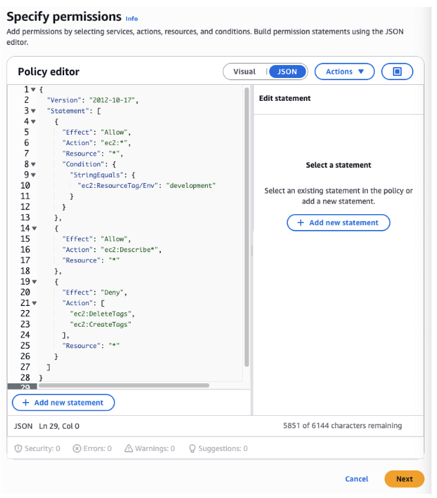
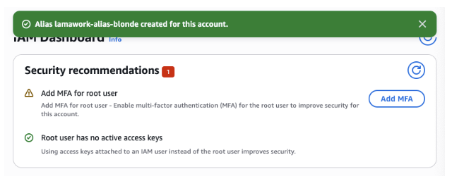
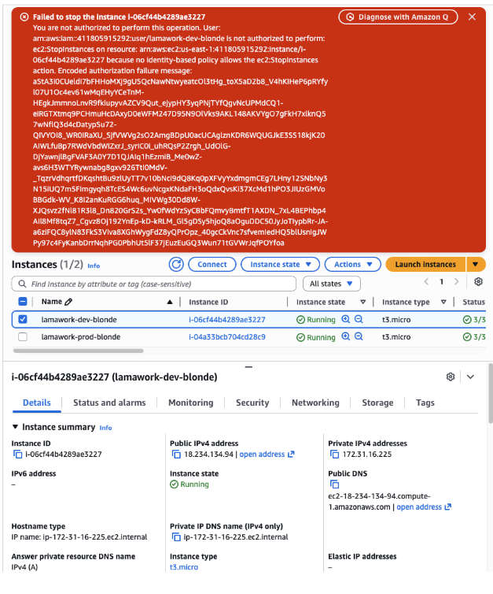

# aws-iam-tag-based-ec2-access-control

## Scenario
An intern should be able to stop development EC2 instances,
but must NOT be able to stop production instances.

## Architecture
- EC2 dev instance (tag: Env=development)
- EC2 prod instance (tag: Env=production)
- IAM Group: dev-interns
- IAM User: intern-dev
- Custom IAM policy with tag condition

### IAM Policy & User

## Key Concepts Demonstrated
- IAM JSON policy structure
- Effect / Action / Resource
- Tag-based access control
- Explicit Deny precedence
- Policy Simulator validation
- Principle of Least Privilege

### EC2 Sign-In

## Test Results
- ✅ Able to stop dev instance
- ❌ AccessDenied on production instance

### Access Denied (Production)

